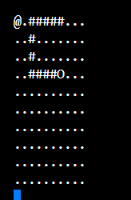

# snake
A snake game implementation in console with Rust language.




## Instalation

* Clone this repository 
```
git clone https://github.com/Padrition/snake.git
```

## Usage 

* Note: To run this source code you must have [rust compiler](https://www.rust-lang.org/learn/get-started) installed.

* Go into installation directory
```
cd snake
```

* Run : 
```
cargo run
```
